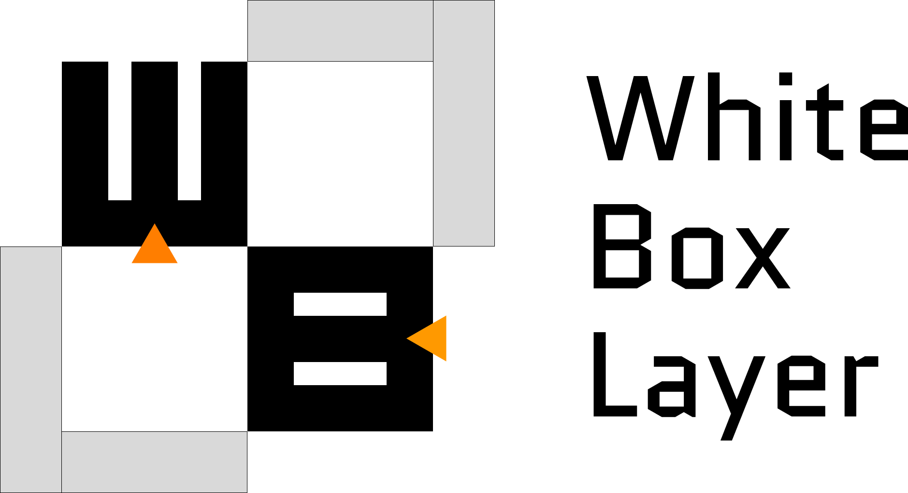

<div align="center">
  <a href="https://pypi.org/project/whiteboxlayer/"><p>
    
  </p></a>
</div>  

---
<a href="https://github.com/YeongHyeon/white-box-layer">White-Box-Layer</a> is a Python module for deep learning built on top of TensorFlow and is distributed under the MIT license.  

The project was started in May 2021 by <a href="https://github.com/YeongHyeon">YeongHyeon Park</a>.  
This project does not limit for participation.  
Contribute now!  

## Installation

### Dependencies
whiteboxlayer requires:
* Numpy: 1.18.5  
* Scipy: 1.4.1  
* TensorFlow: 2.3.0  

### User installation
You can install the white-box-layer via simple command as below.  
``` sh
$ pip install whiteboxlayer
```

## Development
We welcome new contributors of all experience levels. The white-box-layer community goals are to be helpful, welcoming, and effective. The Development Guide has detailed information about contributing code, documentation, tests, and more. We've included some basic information in this README.

## Example

### Example for Convolutional Neural Network
An example of constructing a convolutional neural network is covered. The relevant source code is additionally provided following links.  
* <a href="https://github.com/YeongHyeon/white-box-layer/blob/master/examples/example_cnn.py">Python script</a>  
* <a href="https://github.com/YeongHyeon/white-box-layer/blob/master/examples/example_cnn.ipynb">Jupyter notebook</a>  

#### Define TensorFlow based module
``` python
class Neuralnet(tf.Module):

    def __init__(self, **kwargs):
        super(Neuralnet, self).__init__()

        self.who_am_i = kwargs['who_am_i']
        self.dim_h = kwargs['dim_h']
        self.dim_w = kwargs['dim_w']
        self.dim_c = kwargs['dim_c']
        self.num_class = kwargs['num_class']
        self.filters = kwargs['filters']

        self.layer = wbl.Layers()

        self.forward = tf.function(self.__call__)

    @tf.function
    def __call__(self, x, verbose=False):

        logit = self.__nn(x=x, name=self.who_am_i, verbose=verbose)
        y_hat = tf.nn.softmax(logit, name="y_hat")

        return logit, y_hat

    def __nn(self, x, name='neuralnet', verbose=True):

        for idx, _ in enumerate(self.filters[:-1]):
            if(idx == 0): continue
            x = self.layer.conv2d(x=x, stride=1, \
                filter_size=[3, 3, self.filters[idx-1], self.filters[idx]], \
                activation='relu', name='%s-%dconv' %(name, idx), verbose=verbose)
            x = self.layer.maxpool(x=x, ksize=2, strides=2, \
                name='%s-%dmp' %(name, idx), verbose=verbose)

        x = tf.reshape(x, shape=[x.shape[0], -1], name="flat")
        x = self.layer.fully_connected(x=x, c_out=self.filters[-1], \
                activation='relu', name="%s-clf0" %(name), verbose=verbose)
        x = self.layer.fully_connected(x=x, c_out=self.num_class, \
                activation=None, name="%s-clf1" %(name), verbose=verbose)

        return x
```

#### Initializing module
``` python
model = Neuralnet(\
    who_am_i="CNN", \
    dim_h=28, dim_w=28, dim_c=1, \
    num_class=10, \
    filters=[1, 32, 64, 128])

dummy = tf.zeros((1, model.dim_h, model.dim_w, model.dim_c), dtype=tf.float32)
model.forward(x=dummy, verbose=True)
```

#### Results
``` sh
Conv (CNN-1conv) (1, 28, 28, 1) -> (1, 28, 28, 32)
MaxPool (CNN-1mp) (1, 28, 28, 32) > (1, 14, 14, 32)
Conv (CNN-2conv) (1, 14, 14, 32) -> (1, 14, 14, 64)
MaxPool (CNN-2mp) (1, 14, 14, 64) > (1, 7, 7, 64)
FC (CNN-clf0) (1, 3136) -> (1, 128)
FC (CNN-clf1) (1, 128) -> (1, 10)
Conv (CNN-1conv) (1, 28, 28, 1) -> (1, 28, 28, 32)
MaxPool (CNN-1mp) (1, 28, 28, 32) > (1, 14, 14, 32)
Conv (CNN-2conv) (1, 14, 14, 32) -> (1, 14, 14, 64)
MaxPool (CNN-2mp) (1, 14, 14, 64) > (1, 7, 7, 64)
FC (CNN-clf0) (1, 3136) -> (1, 128)
FC (CNN-clf1) (1, 128) -> (1, 10)
```
